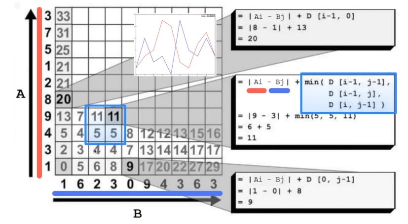
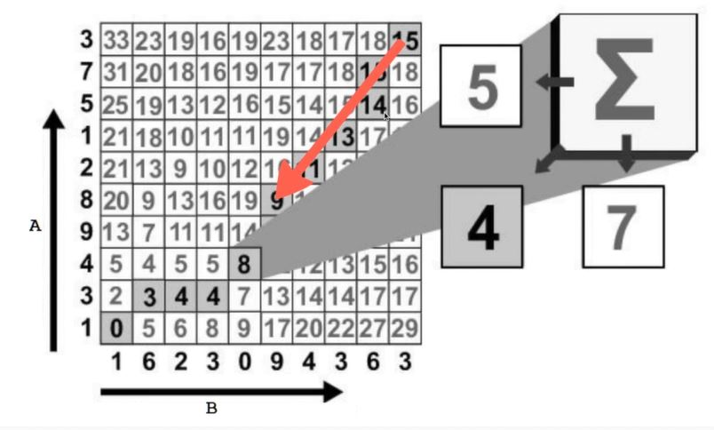

# algorithm-notes

### Dynamic Time Warping (DTW)

* One of the most used measure of the similarity between two time series
* **Optimal global alignment** between two time series, exploiting temporal distortions between them

Distance Matrix

